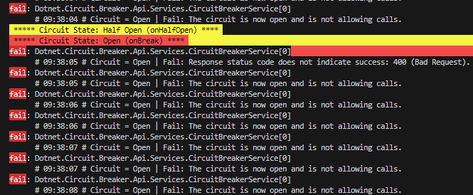

# Dotnet Circuit Breaker

This project was developed to test the circuit breaker in dotnet application using Polly

## Resources used

- DotNet 8
- Polly

## What is circuit breaker?

Circuit breaker is a design pattern in programming used to increase the resilience of distributed systems. It acts like an electrical switch, monitoring interactions between services to prevent cascading failures. When a service is slow or unavailable, the circuit breaker "opens", blocking new requests until the service recovers. This avoids overloading the system with repeated connection attempts that are already doomed to failure.

The pattern generally has three states: closed (requests flow normally), open (requests are blocked) and half-open (a limited number of requests are allowed to test whether the service is functional). It is widely used in microservices-based architectures and cloud systems, ensuring greater stability and allowing systems to recover from temporary failures.

<p align="center">
  
</p>

## Test

Open project and execute command:

```console
dotnet run
```

When execute, [click here](http://localhost:5000/swagger/index.html) and try execute `Post`.

## Execution logs example

### Closed -> Open

<p align="start">
  
</p>

### Open -> Half-open -> Open

<p align="start">
  
</p>

### Open -> Half-open -> Closed

<p align="start">
  
</p>
